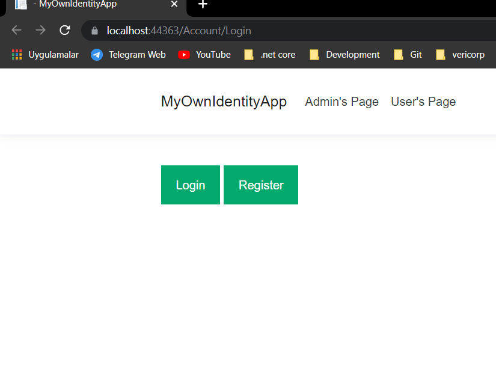
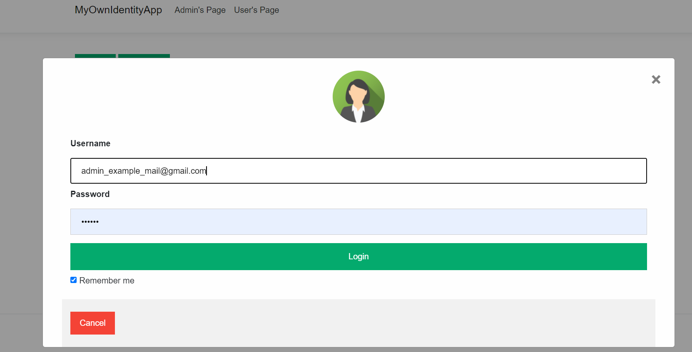
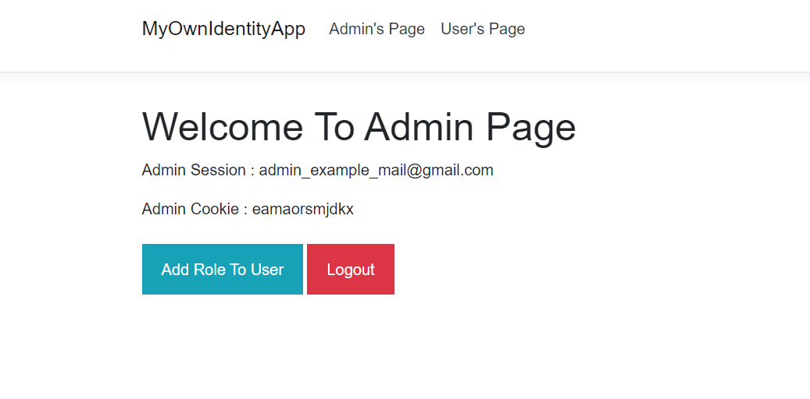
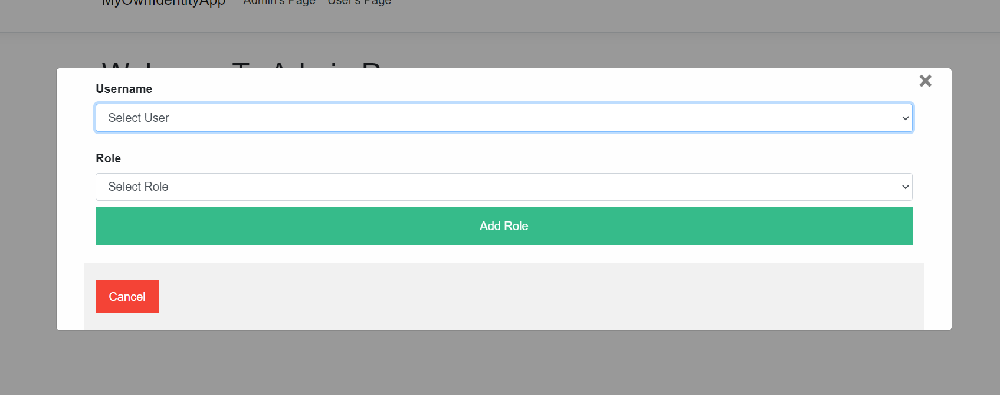

# IdentityApp
Authentication and Authorization without .NET Core Identity
 
 
***I used Entity Framework and MSSQL***
 
 
*This Project has **SeedData**.*
*When the project runs, 2 users will be created automatically, one in admin role and the other in user.Before that, you should make the database connection in **appsettings.json** .*
 
 
*You can register as user. If your role is Admin, you can assign role to other users.*
 
 

 
 
*You can run the project and login with the above user information or you can register as a user (user role). You must use the above admin information to assign roles to users.*
 

 
 
*if you login, you can see information about your session  and cookie. When You logout, your session and cookie are cleared.*
 
 

 
 
*if you login as a Admin, you can role to user.(I have defined 2 roles for simplicity; Admin and User. Only users with **admin role** can assign roles to other users.)*
 
*You can select users which registered in the database and roles (Admin,User)*
 
 

 
